# MCMT App Separation Documentation

This document separates the responsibilities of each app in the platform and shows, with Mermaid diagrams, what each app can do, what it must not do, and how execution changes depending on configuration.

---

## 1. High-level separation

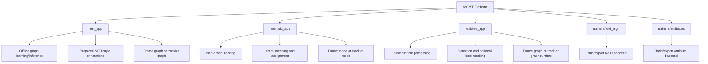

---

## 2. Responsibility matrix

| Component             | Main role                      | Input style                                 | Uses detector  | Uses local tracker   | Uses graphs | Uses GNN       | Uses GT IDs directly     |
| --------------------- | ------------------------------ | ------------------------------------------- | -------------- | -------------------- | ----------- | -------------- | ------------------------ |
| `rest_app`            | Offline graph research         | Prepared MOT-style annotations              | No             | No                   | Yes         | Optional       | Yes                      |
| `heuristic_app`       | Non-graph tracking             | Real inputs or optional prepared detections | Yes, if needed | Optional later       | No          | No             | No                       |
| `realtime_app`        | Runtime online experimentation | Frames/videos                               | Yes            | Yes in tracklet mode | Yes         | Optional later | No                       |
| `trainers/reid_mgn`   | ReID training/export           | Labeled ReID training data                  | No             | No                   | No          | No             | Depends on training data |
| `trainers/attributes` | Attribute training/export      | Labeled attribute training data             | No             | No                   | No          | No             | Depends on training data |

---

## 3. `rest_app`

## 3.1 What `rest_app` is for

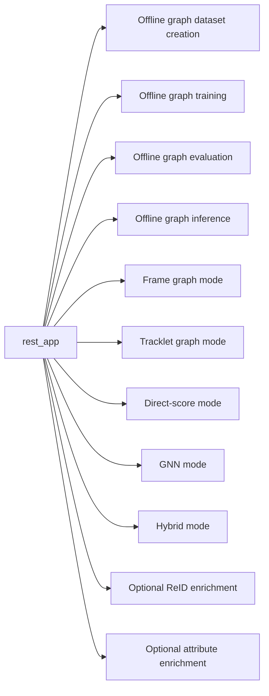

## 3.2 What `rest_app` must never do

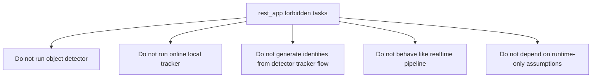

## 3.3 `rest_app` input contract

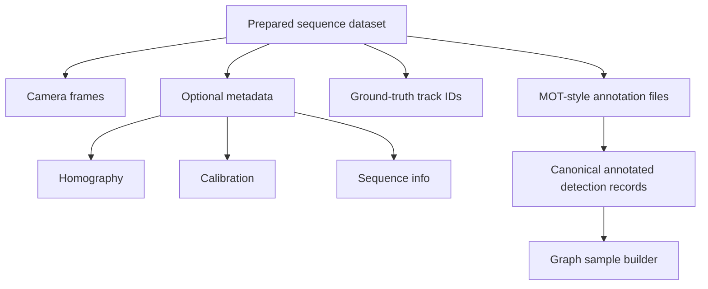

## 3.4 `rest_app` config-driven process

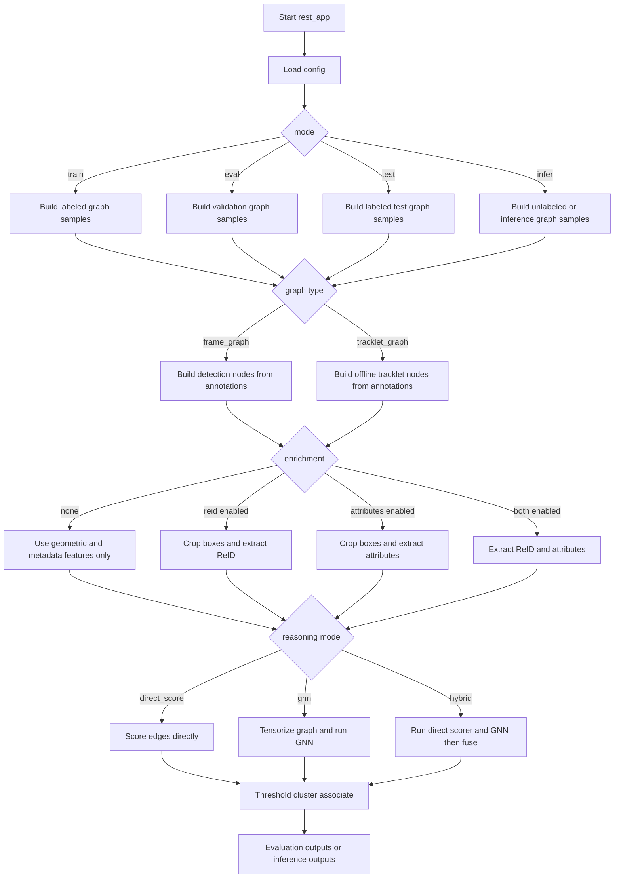

## 3.5 `rest_app` frame graph process

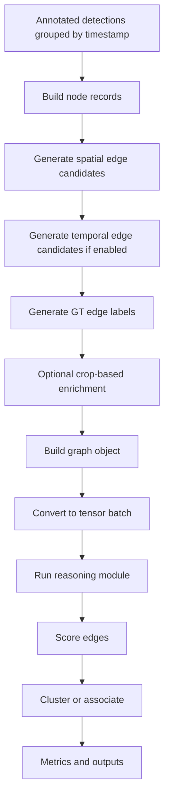

## 3.6 `rest_app` tracklet graph process

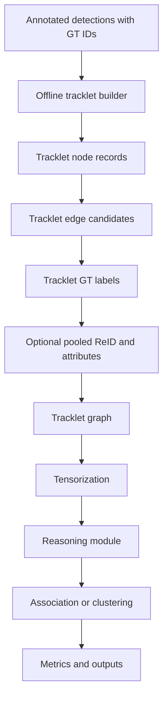

## 3.7 `rest_app` capability summary

* Builds offline graph datasets from prepared annotations
* Can train, evaluate, test, and infer
* Supports frame graph and tracklet graph
* Supports direct score, GNN, and hybrid reasoning
* Can enrich nodes and edges with ReID and attributes
* Uses GT IDs for labeling and evaluation
* Never runs detector or runtime tracker

---

## 4. `heuristic_app`

## 4.1 What `heuristic_app` is for

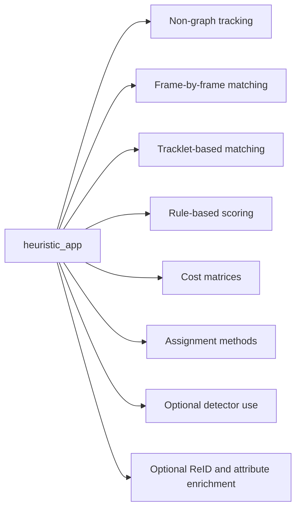

## 4.2 What `heuristic_app` must never do

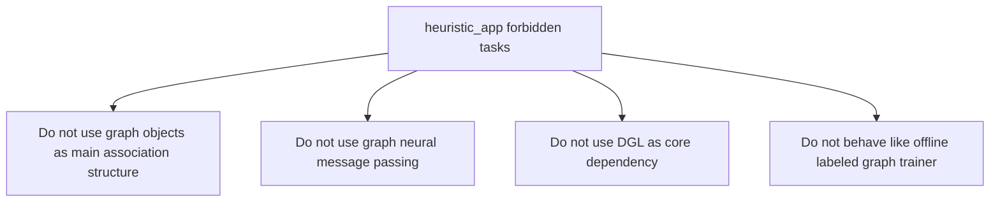

## 4.3 `heuristic_app` config-driven process

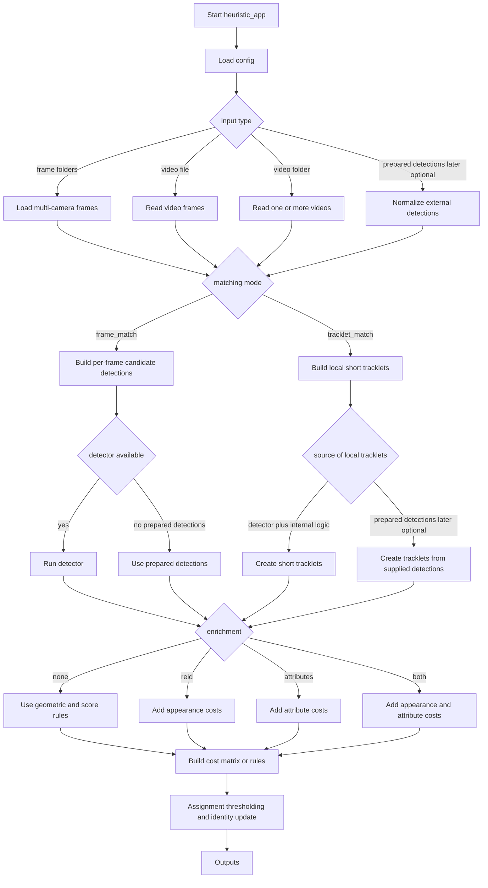

## 4.4 `heuristic_app` frame match process

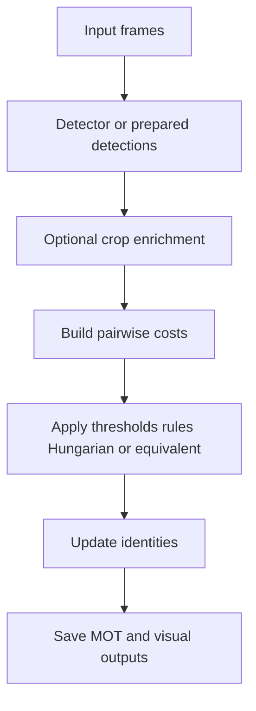

## 4.5 `heuristic_app` tracklet match process

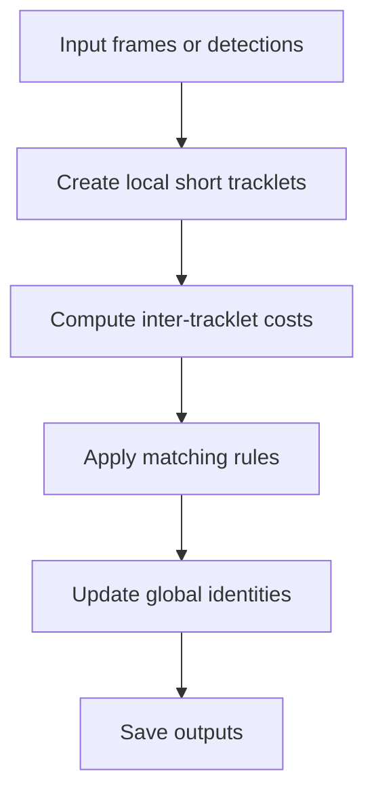

## 4.6 `heuristic_app` capability summary

* Pure non-graph tracking app
* Good for baseline comparisons
* Can use detector if needed
* Can use ReID and attributes directly in costs
* Supports frame mode and tracklet mode
* Does not do GNN or graph reasoning

---

## 5. `realtime_app`

## 5.1 What `realtime_app` is for

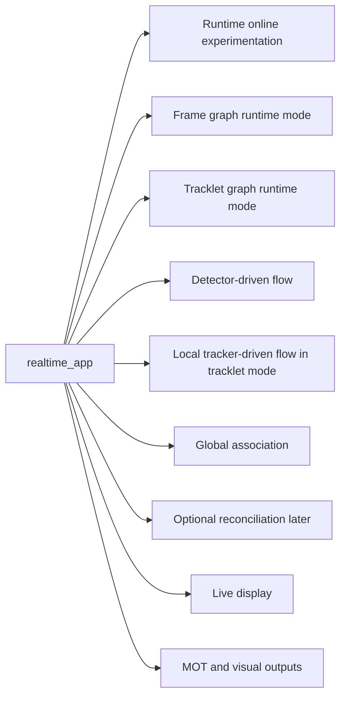

## 5.2 `realtime_app` frame-mode process

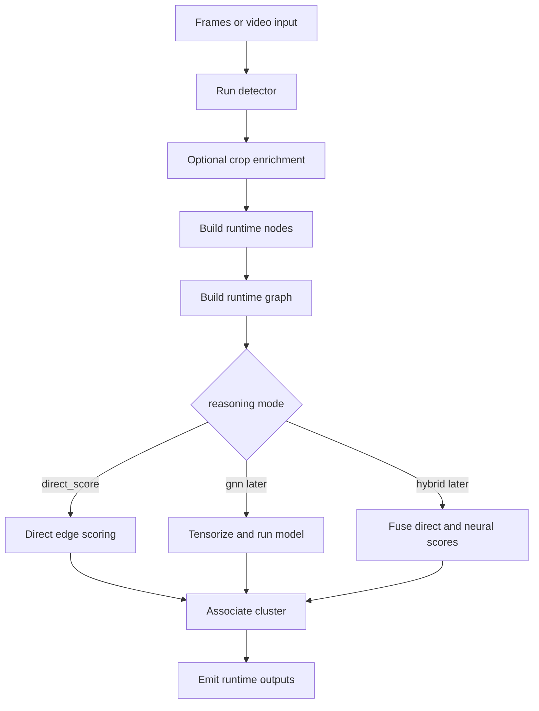

## 5.3 `realtime_app` tracklet-mode process

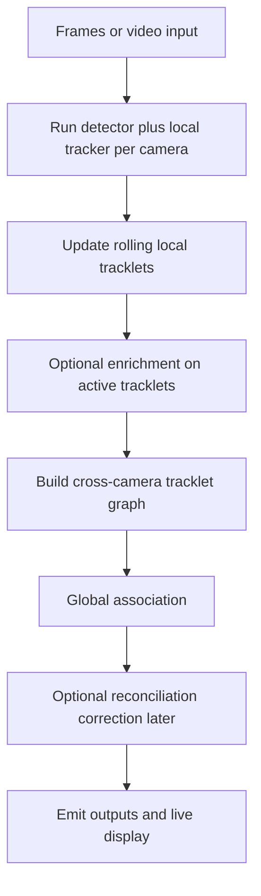

## 5.4 `realtime_app` config-driven process

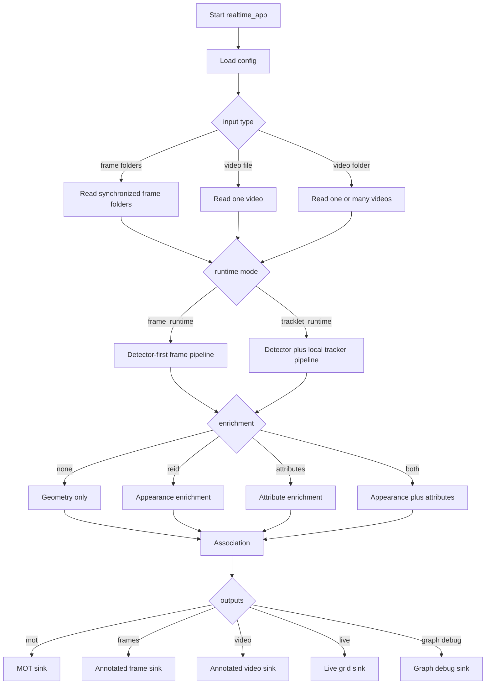

## 5.5 `realtime_app` capability summary

* Handles real online or batch runtime inputs
* Runs detector in frame mode
* Runs local tracker in tracklet mode
* Builds graph association online
* Supports multiple visual and runtime sinks
* Best place for future correction/reconciliation policies

---

## 6. Trainers

## 6.1 Trainer separation

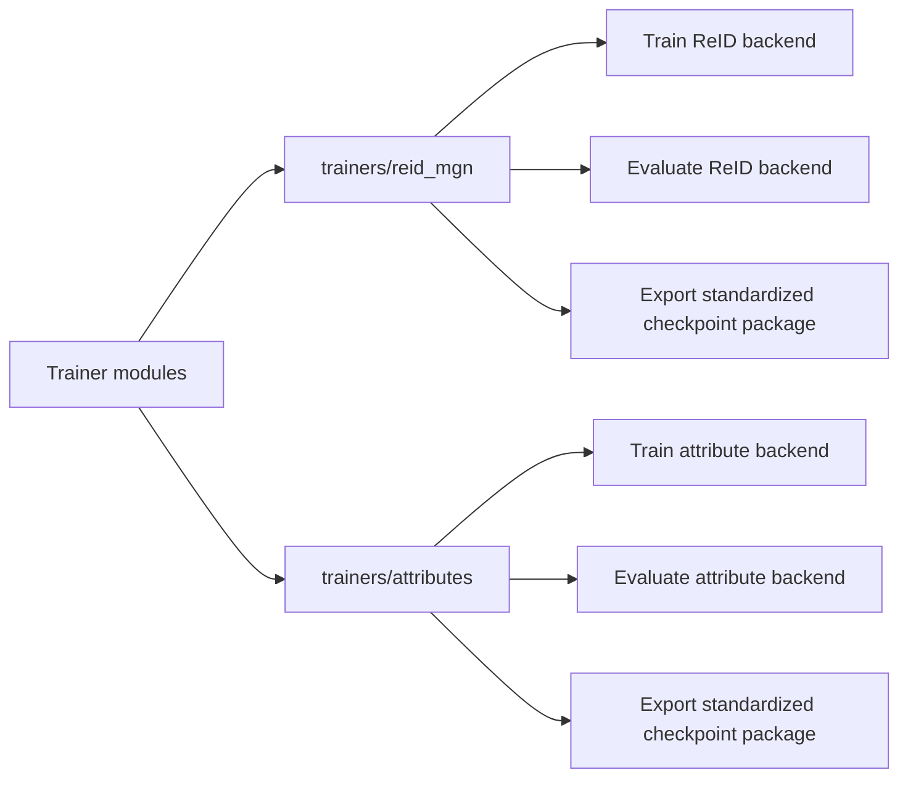

## 6.2 Trainer to runtime relationship

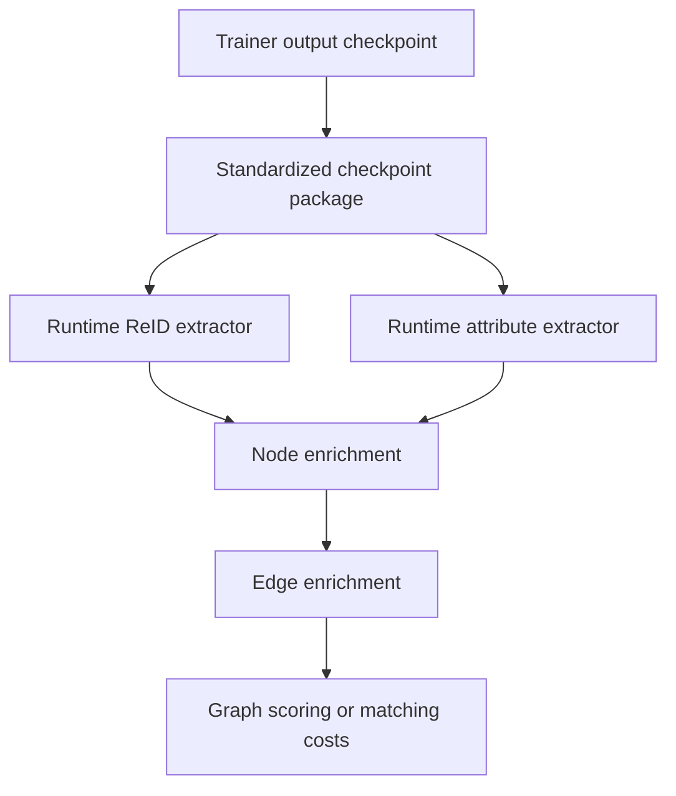

---

## 7. Config-based separation summary

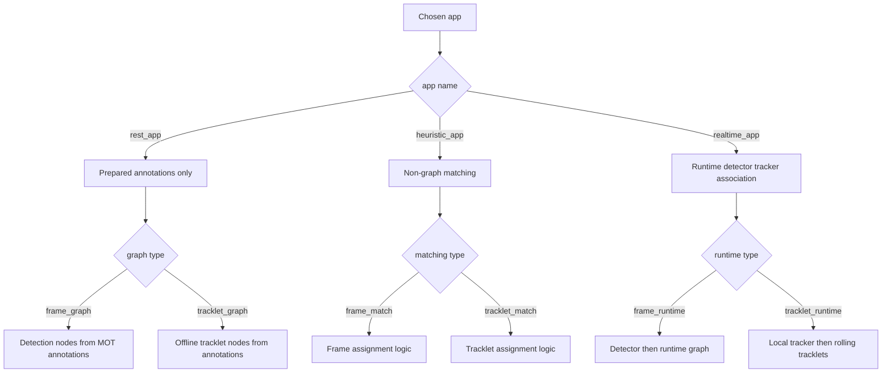

---

## 8. Practical implementation notes from this separation

### 8.1 `rest_app`

* Create dedicated offline dataset adapters for MOT annotation parsing
* Keep GT label creation inside dataset/preprocessing code
* Keep detector/tracker imports out of the `rest_app` core path
* Add offline crop extraction utilities for ReID and attributes

### 8.2 `heuristic_app`

* Keep matching logic matrix-based or rule-based
* Do not reuse graph builders as the main internal representation
* ReID and attributes should directly modify costs or assignment filters

### 8.3 `realtime_app`

* Keep runtime input readers separate from graph logic
* Keep local tracker state separate from global association state
* Reconciliation should be a separate module, not mixed into local tracking

### 8.4 trainers

* Export standardized packages early
* Let runtime adapters depend on package format, not trainer code layout

---

## 9. Final non-negotiable separation rules

* `rest_app` is annotation-driven and GT-aware
* `rest_app` does not run detector or local tracker
* `heuristic_app` is non-graph and non-GNN
* `realtime_app` is runtime CV and association logic
* trainers only train/export backends
* shared utilities belong in `mcmt_core`
* app-specific orchestration must stay inside the corresponding app
